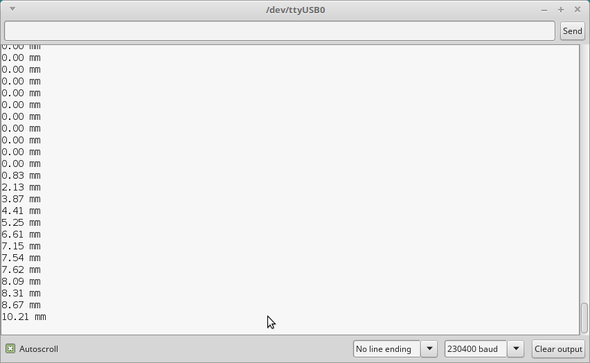

# Digital indicator decoder
This repository provides a protocol decoder of the digital interface of a [digital indicator that we have found on eBay](https://www.ebay.de/itm/333886026673). The output data is provided as serial output:

 

This digital indicator does not only have a monochrome LC display but it also provides the measurement data stream digitally over the physical "USB" interface (as a digital signal between D+ and GND). The digital indicator itself is not a compatible USB device but it can be charged through its micro USB cable.

This data stream can be read as 6 bytes which contain the measurement value including flags about the unit (mm or inch) and a sign bit. Interestingly the device also streams data even when it is switched off (only the display seems to be switched off).

The code has been tested to run on an Arduino Nano but is likely to work on other targets.

Current limitations: units need to be switched to millimeters to function properly.